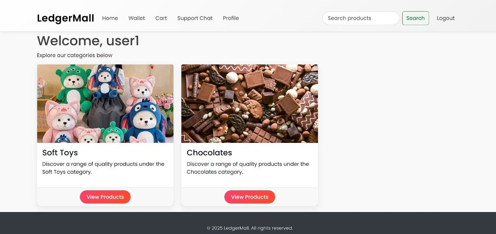

# 🧾 LedgerMall – Decentralized Digital Commerce

**LedgerMall** is a secure, crypto-powered e-commerce platform built with **Python**, **Flask**, and **MongoDB**. It supports multiple cryptocurrencies for product purchases, real-time admin analytics, built-in support chat, and wallet integration—making it a future-forward digital shopping experience.

---

## 🚀 Features at a Glance

- 🔐 **User Authentication** — Sign up, login, hashed password security  
- 🛍️ **Product Marketplace** — Category filters, detail pages, reviews  
- 💼 **In-App Wallets** — Manual deposits & crypto-based balance tracking  
- 🧾 **Cart & Checkout** — Add/remove items, pay via CoinPayments API  
- 🧑‍💼 **Admin Panel** — Add/edit/delete products, view metrics, manage messages  
- 💬 **Support System** — Message-based user queries & admin replies  
- 📊 **Dashboard Metrics** — Orders, revenue, user activity  
- ⭐ **Product Reviews** — Users can rate & review products  
- 🔎 **Search & Filters** — Real-time product search & price filtering

---

## 📁 Project Structure

```
LedgerMall/
├── app.py               # Main Flask application
├── db/                  # MongoDB database models and connection
│   ├── products.py      # Product-related database operations
│   ├── users.py         # User-related database operations
├── config.py            # Configuration settings 
├── config.yaml          # API keys
├── templates/           # HTML templates for the project
└── requirements.txt     # Python dependencies for the project
```

---

## 📷 Screenshots

| Marketplace | Admin Panel |
|-------------|-------------|
|  |  |

---

## 🛠️ Setup Instructions

### 1️⃣ Clone the Repository

```bash
git clone https://github.com/yourusername/ledgermall.git
cd ledgermall
```

### 2️⃣ Install Dependencies

```bash
pip install -r requirements.txt
```

<details>
<summary>📦 Click to see required packages</summary>

```txt
Flask
flask-login
flask-bcrypt
pymongo
pycoinpayments
```

</details>

### 3️⃣ Configure MongoDB

Ensure MongoDB is running locally or use a remote cluster. Create a database called `ledgermall` with two collections:

- `users`
- `products`

**Sample DB connection (`db.py`):**

```python
import pymongo
client = pymongo.MongoClient("mongodb://localhost:27017/")
db = client["ledgermall"]
```

---

## 👑 Admin Setup (Manual via MongoDB)

Create an admin user directly in the `users` collection. Sample document:

```json
{
  "username": "admin",
  "email": "admin@example.com",
  "password": "<bcrypt_hashed_password>",
  "is_admin": true
}
```

To generate a bcrypt hash:

```python
from flask_bcrypt import Bcrypt
bcrypt = Bcrypt()
print(bcrypt.generate_password_hash("yourpassword").decode())
```

> ⚠️ There’s no web interface to set up admin yet. Use MongoDB Compass or CLI.

---

## 🔐 API & App Configuration

Create a `config.py` file and populate with the following:

```python
SECRET_KEY = "your-secret-key"
CP_PUBLIC_KEY = "your-coinpayments-public-key"
CP_PRIVATE_KEY = "your-coinpayments-private-key"
BUYER_EMAIL = "buyer@example.com"

COIN_MAPPING = {
    "btc": {"currency2": "BTC", "address": "your-btc-address"},
    "ltc": {"currency2": "LTC", "address": "your-ltc-address"},
    ...
}
```

> ⚠️ Keep this file secure and don’t commit it publicly.

---

## 🔒 Security Practices

- Use **HTTPS** in production  
- Keep **MongoDB secure** and password-protected  
- **Environment variables** for secrets (avoid plain `config.py` in production)  
- Validate & sanitize all user inputs  
- Restrict admin routes via `is_admin` checks

---

## 📊 Future Add-ons (Roadmap Ideas)

- 📨 Telegram or email order notifications  
- 🆔 Verified user tiers (KYC)  
- 🧾 Auto-generated PDF invoices  
- 📱 Mobile-friendly UI/UX  
- 🪝 REST API integration for external platforms or Telegram bots

---

## 🤝 Contribution Guide

We welcome your contributions! Here's how:

1. Fork the repo  
2. Create your feature branch (`git checkout -b feature/cool-feature`)  
3. Commit your changes  
4. Push to the branch (`git push origin feature/cool-feature`)  
5. Open a Pull Request

---

## 🛠 Built With

| Tech Stack | Description |
|------------|-------------|
| **Python & Flask** | Backend framework |
| **MongoDB** | NoSQL database |
| **Jinja2** | Templating engine |
| **CoinPayments API** | Crypto payment gateway |
| **HTML/CSS/JS** | Frontend foundation |

---

## 📄 License

This project is licensed under the [AGPL License](LICENSE).

- You are free to modify, distribute, and use the code **for non-commercial purposes only**.
- Any modifications and distributions of the project must also be licensed under the AGPL.
- You may **not** use this code for commercial purposes without explicit permission.
- If you use this code in a publicly accessible system, you must make the source code available to the users of that system.
- **Credits:** Please give appropriate credit to the original author, **Samrat Talukdar**.

Feel free to make it your own, but please ensure that the AGPL license terms and the non-commercial restriction are followed.

---

## Crafted with 💻, ☕, and a bit of ₿itcoin, by [Samrat](github.com/ogsamrat)<3  
> _LedgerMall isn't just a store — it's your step into a decentralized future._  
> Buy, sell, and grow securely with crypto at your fingertips. 🛒💸🛡️
